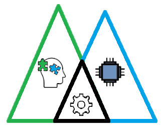
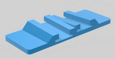
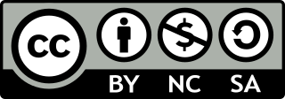

# OpenLEDrace-2-4-Cars

Capses per control Open LED Race 

 

Realitzada per [Jordi Mayné](https://github.com/maynej) des de Mechatronic Study 

L'objectiu es tenir unes capses lleugeres per incloure la placa de control Arduino i el connexionat.

La [documentació es pot trobar en PDF](https://github.com/maynej/OpenLEDrace24cars/tree/main/OpenLEDrace24cars/DOC). També en llengua castellana.

El Firmware utilitzat [es pot trobar a](https://github.com/maynej/OpenLEDrace24cars/tree/main/OpenLEDrace24cars/Firmware). 

STL per imprimir [aquí](https://github.com/maynej/OpenLEDrace24cars/tree/main/OpenLEDrace24cars/STL).

## Caspses 3D 
  
Descripció         | Imatge          | Arxius STL         
------------- | ------------- | ------------- 
Capsa 2/4 jugadors | | [Capsa 2/4 jugadors](OpenLEDrace24cars/STL/CapsaArduinoOpenLedRaceV1.stl)
Tapa 2/4 jugadors | | [Tapa 2/4 jugadors](OpenLEDrace24cars/STL/TapaArduinoOpenLedRaceV1.stl)
Capsa 4 jugadors | | [Capsa 4 jugadors](OpenLEDrace24cars/STL/Capsa_ArduinoGran4Players.stl)
Tapa 4 jugadors | | [Tapa 4 jugadors](OpenLEDrace24cars/STL/TapaArduino4Players.stl)
Suport Loop | | [Suport Loop](OpenLEDrace24cars/STL/SuportLoopOLR.stl)

## Polsadors 3D
Descripció         | Imatge          | Arxiu         
------------- | ------------- | ------------- 
Polsador ergonomic | | [Polsador ergonomic](OpenLEDrace24cars/STL/OpenLedRace_Handle.stl)

## QR

## Llicència

Creative Commons Attribution-NoComercial-ShareAlike 4.0 International (CC BY-NC-SA 4.0)  
